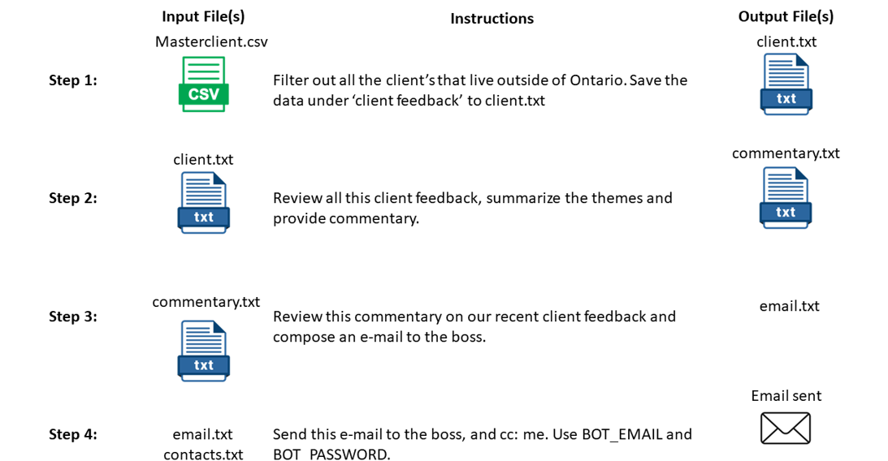

## What is AutoNL?

AutoNL uses Open-Interpreter to automate multi-step tasks with the help of a simple spreadsheet. The basic insight here is OI, AutoGPT, etc all begin to break down when their planning enters a loop. But we often actually know the plan we want it to follow anyway, we just to leverage it to execute. So this puts all the responsibility for execution on AI, but all the responsibility for planning on the human.

## Setup

- Install dependencies `pip install -r requirements.txt`
- Create a file called `.env`
- Copy `.env.example` keys to `.env`
- Add `.env` values

## Use

- run `python main.py <full path to spreadsheet/csv>`

## How AutoNL Works:

AutoNL is a script and a spreadsheet. The spreadsheet has the following columns "STEP", "INPUT FILE(s)", "INSTRUCTION", and "OUTPUT FILE(s)". The script just does the job of running through the process one time, validating each step, and finally hashing the files and moving them to one directory.

## Where can I find a demo?

The first demo is right here: https://youtu.be/aCa8ntYIkpM, but I'm planning to record a few more - right now I've got the tool hooked up to e-mail, authenticated with Microsoft Graph, routing tasks between sheets, etc - lots to come.

## Does this work 100% of the time?

Absolutely not. This is experimental and is prone to various failures, but can also become quite reliable. The example sheet 'datapre.xlsx' typically matches hashes on outputs about 80% of the time currently. I expect future models will only continue to improve the quality and reliability, while local models like OpenCodeInterpreter will make local offline use achievable.

## Why did you do this?

Thank you for asking. I think AI tools are constantly trying to automate the user out of the loop, but my own experience is that I want to be fully in the loop at all times. I want to the loopmaster, and I want tools that put me at the centre and give me visibility and control over everything. AutoNL turns the entire pipeline into natural language. Even the script itself is built primarily in Natural Language, controlled by Open-Interpreter.

## What's the roadmap?

Short-term roadmap would be to make it easier to build new sheets. I want a command line flag that we can run to start a sheet on a given step, I want to be able to control the model and system prompt from inside the spreadsheet, and I'd also like to spend some time on creating an AutoNL sheet that helps build AutoNL sheets - that's the dream.

## Credits
https://github.com/KillianLucas/open-interpreter - This project is made possible by the Open Interpreter project, which allows GPT4 to take action on your computer. 

## Warning

AutoNL is experimental and prone to failures. Use at your own risk. 

## License 

Apache 2

## Tips

The script will create and read documents in the directory of the file you pass in.

Be sure to use the full file path.

You can drag and drop the file into Terminal to paste the path.

Be specific and use precise instructions and column references wherever possible. 

## Example 

Use autonl-example.xlsx to run a 7-step example process.

## Known Errors

Open-Interpreter will sometimes prematurely stop the generation without completing a step's task. Re-run the process to try again.
